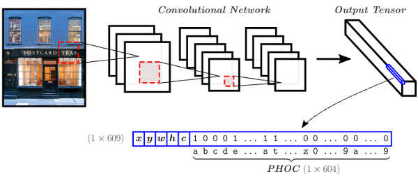

# SingleShotSTR

**Single Shot Scene Text Retrieval**, ECCV 2018.

L. Gomez*, A. Mafla*, M. Rusiñol, D. Karatzas.

In this paper we address the problem of scene text retrieval: given a text query, the system must return all images containing the queried text. The novelty of the proposed model consists in the usage of a single shot CNN architecture that predicts at the same time bounding boxes and a compact text representation of the words in them. In this way, the text based image retrieval task can be casted as a simple nearest neighbor search of the query text representation over the outputs of the CNN over the entire image database.



Our Convolutional Neural Network predicts at the same time bounding box coordinates (x,y,w,h), an objectness score c, and a pyramidal histogram of characters (PHOC) of the word in each bounding box.

If you make use of the code in this repository for scientific purposes, we appreciate it if you cite our paper:

```
@inproceedings{GomezMaflaECCV2018single,
  title     = {Single Shot Scene Text Retrieval},
  author    = {Lluis Gomez, Andres Mafla, Marçal Rusiñol, and Dimosthenis Karatzas},
  booktitle = {ECCV},
  year      = {2018}
}
```

## Dependencies

[Tensorflow](https://www.tensorflow.org/) >= 1.0.1 (tested with 1.10.1, 1.4.1 and 1.0.1)

Numpy, Sklearn, Scipy, ...

### cphoc

A C program to build PHOC descriptors of the query strings. The cphoc library must be compiled as follows:

```
cd single-shot-str/cphoc/
gcc -c -fPIC `python-config --cflags` cphoc.c
gcc -shared -o cphoc.so cphoc.o `python-config --ldflags`
```

NOTE: the cphoc lib only works with python2.7

## Pretrained model

Download the following files and place them into the ``ckpt/`` folder:

[yolo-phoc_175800.ckpt.data-00000-of-00001](https://drive.google.com/open?id=1L0NCJP52q_hLMcYIxJJV9FvZo9XC9-bT)

[yolo-phoc_175800.ckpt.index](https://drive.google.com/open?id=1nI0Z4PSG9YZQrcjfly7xMbuNns_gPGat)

## Experiments

The ``eval_STR.py`` script reproduces the results of the experiments in our paper with the IIIT\_STR and Sports10K datasets.

### Set up data

Download and uncompress the datasets into the ``datasets/`` folder. Follow the specific instructions provided in: [datasets/README.md](datasets/README.md)

Once you have downloaded the data and pretrained model, you can just run the script:

```
python eval_STR.py
```

The script will calculate the mean Average Precision for the given dataset and save the top10 results for each query in a json file.

There are some parameters that you may want to play with at the beginning of the ``eval_STR.py`` script:

```
    img_shape    = (608, 608, 3)
    num_priors   = 13
    phoc_size    = 604
    weights_path = './ckpt/yolo-phoc_175800.ckpt'
    thresh       = 0.002
    n_neighbors  = 10000
    gt_data_path = './datasets/IIIT_STR_V1.0/data.mat' # uses GT format of IIIT_STR & Sports10K datasets
    inp_path     = './datasets/IIIT_STR_V1.0/imgDatabase/'
```

## Training

We do not provide our training code here because it is dependent in our own modification of the [Darknet](https://pjreddie.com/darknet/) C framework. However, the training can be reproduced by following the details in the paper.

### Training data

We have trained our model in a modified version of the synthetic dataset of Gupta et al.[1]. Their dataset generator has been modified to use a custom dictionary with the 90K most frequent English words with the rationale that in the original dataset there was no control about word occurrences, and the distribution of word instances had a large bias towards stop-words and words with special characters or non ASCII symbols that we do not contemplate in our PHOC representation. Moreover, since the PHOC representation of a word with a strong rotation does not make sense under the pyramidal scheme employed, the dataset generator was modified to allow rotated text up to only 15 degrees. This way we generated a dataset of ~1 million images for training purposes.

The SynthText\_90KDict dataset can be downloaded [here](http://datasets.cvc.uab.es/rrc/SynthText_90KDict.tar) (41Gb).

Notice that in a second training stage we also use the ICDAR15 and ICDAR13 datasets that can be downloaded from the [Robust Reading Competition website](http://rrc.cvc.uab.es).

[1] A. Gupta, A. Vedaldi, A. Zisserman. Synthetic data for text localisation in natural images. CVPR 2016.

